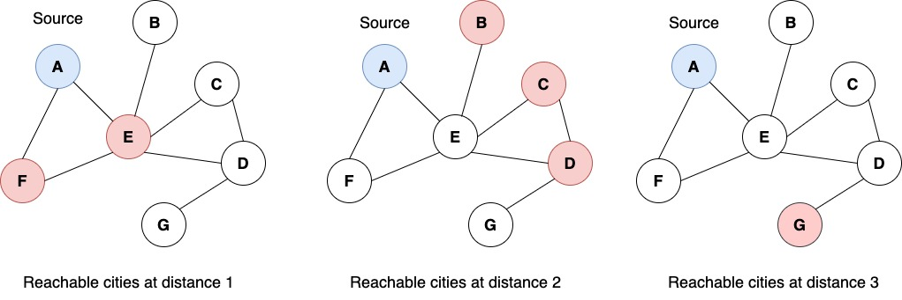

# Graph

## Overview

In this assignment, you will apply BFT for finding distances between connected vertices in a graph.

The graph will be implemented using the following struct: 

```
struct vertex;
struct adjVertex{
    vertex *v;
};

struct vertex{

    string name;
    bool visited = false;
    int distance = 0;
    vector<adjVertex> adj;

};
```

**NOTE: You are welcome to use the *main* function to test your code. The code in *main_1.cpp* is not being graded for this assignment.**

## Class Specifications

The **Graph** class definition is provided in the file `Graph.hpp`. Do not modify this file! Fill in the TODO implementations in file `Graph.cpp` according to the following specifications. 

**void addVertex(string name);** 
+ Add new vertex `name` to the graph.

**void addEdge(string v1, string v2);** 
+ Add an edge between vertices named `v1` and `v2`.

**void displayEdges();** 
+ Display all the edges in the graph in the following format:

If we create a graph with the following structure.

```
graph.addVertex("Chicago");
graph.addVertex("NYC");
graph.addVertex("Boston");

graph.addEdge("Chicago", "Boston");
graph.addEdge("NYC", "Boston");
```

We print the edges in the following manner.

```
Chicago --> Boston
Boston --> NYC Chicago
NYC --> Boston
```

The order of vertices printed is the same as the order in which they were added to the graph. Similarly, the order of vertices to the right of `-->` sign is the same as the order in which the
corresponding edge was added to the graph.

**void breadthFirstTraverse(string sourceVertex);**
+ Breadth first traversal from `sourceVertex`. Format for printing:

```
// for the source vertex in the graph
cout<< "Starting vertex (root): " << vStart->name << "->";
// for other vertex traversed from source vertex with distance
cout << n->adj[x].v->name <<"("<< n->adj[x].v->distance <<")"<< " ";
```

**int findReachableCitiesWithinDistanceK(string source, int k);**
+ Imagine that you are in some city (i.e. the source vertex) and your fuel allows you to go a maximum distance of  `k`.  You decide that you want to use up the entire fuel to reach a city and stay the night. However, you want to be as efficient as possible; therefore, you will take the *shortest path* to the destination city. In this context, this method will provide the vector of all cities reachable (i.e. is at a minimum distance of `k`) from the `source` city.
  
Considering the following city graphs, we have **A** as the `source` city, coloured in *blue*, and the reachable cities coloured in *red*. 




### Order of function implementation

1. addVertex
2. addEdge and displayEdges
3. breadthFirstTraverse
4. findReachableCitiesWithinDistanceK
